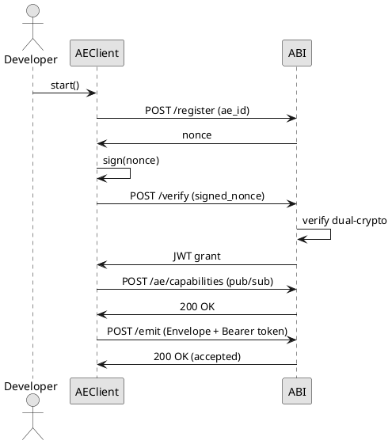

# AEGNIX AE SDK

The **AEGNIX AE SDK** empowers developers to build autonomous **Atomic Experts (AEs)**—micro-agents that authenticate, declare their dynamic capabilities, publish signed intelligence, subscribe to swarm topics, and interoperate securely inside the **AEGNIX Mesh**.

Phase **3G** introduces **Dynamic Capability Declaration**, allowing AEs to specify their `publishes` and `subscribes` lists during registration and runtime. The ABI Service merges these with static policy to produce a unified, real-time authorization model.

This SDK is the *agent-side runtime* for building distributed, secure, policy-aware AEGNIX swarms.

---

## Overview

| Component              | Description                                                                               |
| ---------------------- | ----------------------------------------------------------------------------------------- |
| **AEClient**           | Manages registration, dual-crypto handshake, JWT grant, capability declaration, emission. |
| **Envelope**           | Shared signed message schema from `aegnix_core`.                                          |
| **Transport Adapters** | Local (default), HTTP → ABI, Pub/Sub (Phase 3F), Kafka (Phase 4).                         |
| **Keypair Tools**      | Helper utilities for generating AE ed25519 keypairs.                                      |
| **Decorators**         | Helpers for subscription/event routing inside AE code.                                    |

---

## AE → ABI Flow (PlantUML)



---

## Directory Structure

```
aegnix_sdk/
├── aegnix_abi/
│   ├── admission.py
│   ├── audit.py
│   ├── keyring.py
│   ├── policy.py
│   └── transport_pubsub.py
├── aegnix_ae/
│   ├── client.py
│   ├── capability_client.py
│   ├── decorators.py
│   ├── make_keypair.py
│   └── transport/
│       ├── transport_base.py
│       ├── transport_http.py
│       ├── transport_local.py
│       ├── transport_gcp_pubsub.py
│       └── transport_kafka.py
├── tests/
│   ├── test_ae_sdk.py
│   ├── test_capabilities.py
│   ├── test_transport_factory.py
│   └── test_abi_sdk.py
└── pyproject.toml
```

---

## Installation

Install **AEGNIX Core**:

```bash
cd ../aegnix_core
pip install -e .
```

Install **AE SDK**:

```bash
cd ../aegnix_sdk
pip install -e .
```

Verify:

```bash
pip list | grep aegnix
```

---

## Running Tests

```bash
pytest -v -s --log-cli-level=DEBUG tests/
```

Expected (Phase 3G):

```
6 passed, 0 failed
```

Confirms:

* Dual-crypto handshake
* JWT grant received
* Capability declaration accepted by ABI
* Signed envelope accepted by `/emit`
* Local + HTTP transports stable
* Capability enforcement through ABI

---

## Phase 3G: Dynamic Capability Declaration

Phase 3G introduces:

### **1. AE Capability Declaration**

AEs now call:

```python
client.declare_capabilities(
    publishes=["fusion.track"],
    subscribes=["fusion.roe"],
)
```

The ABI Service validates:

* AE identity (JWT `sub`)
* Subject existence in static policy
* Writes capabilities to SQLite
* Hot-reloads unified policy

---

### **2. Unified Dynamic Policy**

The ABI merges:

* **Static YAML Policy** (`policy.yaml`)
* **Dynamic AE Capabilities** (declared at runtime)

This produces a real-time authorization layer that adapts to swarm configuration.

---

### **3. Enforced at Emit-Time**

When AE calls:

```python
client.emit(subject="fusion.track", payload=data)
```

ABI enforces:

1. JWT session validity
2. AE's publish rights
3. AE trust status
4. Envelope signature validation

---

## How the AE SDK Works

### 1. Registration

`AEClient.register_with_abi()`:

* Requests nonce
* Signs using ed25519 private key
* Verifies via `/verify`
* Receives JWT

---

### 2. Capability Declaration (NEW in 3G)

`AEClient.declare_capabilities()` sends AE’s full `publishes` and `subscribes` lists to ABI.

Example:

```python
client.declare_capabilities(
    publishes=["adsb.track"],
    subscribes=["roe.decision"],
    meta={"version": "1.0.0"}
)
```

---

### 3. Emission

```python
client.emit(subject, payload)
```

The SDK:

* Builds signed `Envelope`
* Injects `Authorization: Bearer <jwt>`
* Sends through the selected transport

---

### 4. Subscription

```python
@client.subscribe("adsb.track")
def handle_track(msg):
    ...
```

Works with local adapter or SSE via ABI.

---

## Developer Notes

* AE stores private key in memory; never persisted.
* Supports multiple transports:

  * `LocalAdapter`: CI-friendly in-process bus
  * `HTTPAdapter`: production ABI
  * `PubSubAdapter`: GCP backend (3F)
  * `KafkaAdapter`: phase 4
* Fully compatible with ABI Service Phase 3G

---

## Definition of Done (Phase 3G)

* [x] Dual-crypto registration
* [x] JWT grant
* [x] Dynamic capability declaration
* [x] Hot-reload unified policy
* [x] Verified `/emit` path with dynamic policy
* [x] AE SDK integration tests pass

---

## Next Steps

**Phase 4**

* Kafka Swarm Transport
* Distributed AE Orchestration

**Phase 5**

* UIX Integration
* Multi-ABI Federation

---

**Repository:** `github.com/invictus-insights/aegnix_ae_sdk`

**Author:** Invictus Insights R&D

**Version:** 0.3.9 (Phase 3G Complete)

**License:** Proprietary / Pending Patent Filing
